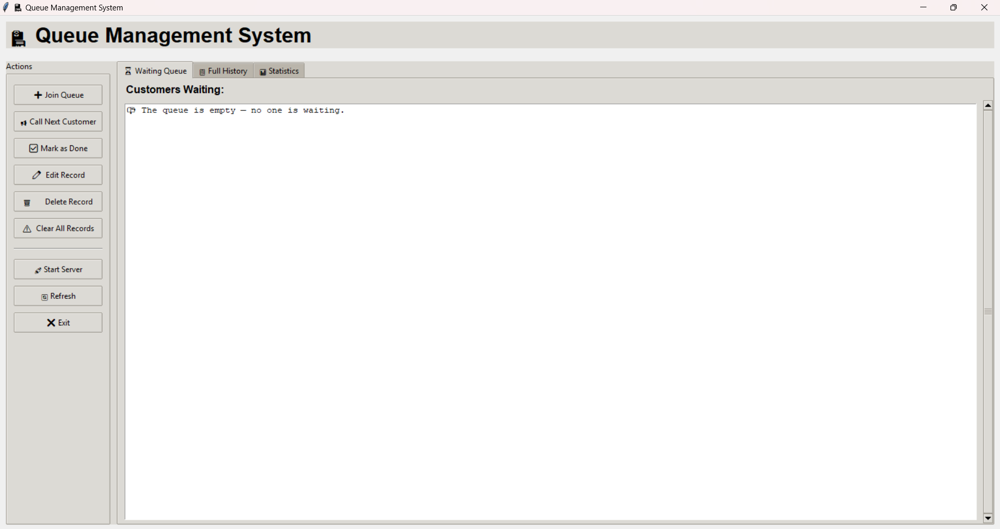

# Queue Management System

A Python-based queue management system with database persistence, featuring a command-line interface and a REST API. Perfect for managing customer queues in retail, healthcare, service centers, and more.

## Group Members
- [Justine Dela Peña](https://github.com/justine0806/My-fort-folio)
- [Jex Malibiran](https://github.com/Yukihira-Kurozawa/My-Profile-)
- [Jeremih Gianzon](https://github.com/daylighttg/IT1C_Portfolio_Gianzon)
- [Zyrenne Lucero](https://github.com/dokidawn/dokidawn)
- [Aira Segovia](https://github.com/aira112507/readme-)
- [Annadel Apolinario](https://github.com/anadelbagona/Ana)


## Features

- **Real-time Queue Management**: Join, call, and complete queue entries instantly
- **Persistent Storage**: SQLite database ensures data survives system restarts
- **Full History Tracking**: View complete records of all queue activities
- **Statistics Dashboard**: Monitor queue performance and customer flow
- **Record Management**: Delete individual records or clear entire history
- **Network Access**: API server accessible from any device on your network
- **Zero Configuration**: Works out of the box with no database setup required

## Project Structure

```
Queue System/
├── documentation/          # Project documentation
│   ├── flowchart.md        # System logic flowchart
│   └── pseudocode.md       # Pseudocode
├── images/                 # Visual assets
├── source/                 # Application source code
│   ├── main.py             # GUI entry point
│   ├── requirements.txt    # Python dependencies
│   ├── queue_system.db     # SQLite database file (created on first run)
│   ├── core/               # Shared business logic & data layer
│   │   ├── database.py     # SQLite connection and table setup
│   │   ├── exceptions.py   # Custom exception classes
│   │   └── queue_logic.py  # All queue operations (join, call, done, ...)
│   ├── api/                # Flask REST API
│   │   └── server.py       # HTTP endpoints consumed by mobile / web clients
│   └── tests/              # Unit tests
│       ├── test_fixes.py   
│       └── test_queue_logic.py
└── README.md               
```

### Module Descriptions (in `source/`)

- **`core/database.py`** — Manages SQLite connection and creates tables on first run. The database file (`queue_system.db`) is stored at the `source/` root.
- **`core/queue_logic.py`** — Pure business-logic functions that return data (no printing). Shared by GUI and API to eliminate code duplication.
- **`api/server.py`** — Flask REST server exposing the queue system over HTTP on port 5000.
- **`main.py`** — Interactive command-line interface with menu system.
- **`core/exceptions.py`** — Custom exceptions used across the application.
- **`tests/`** — Contains `test_fixes.py` and `test_queue_logic.py` for ensuring system stability.

## Requirements

- Python 3.7 or higher
- Flask 2.3.3+ (for the API server only)
- SQLite3 (included with Python)

## Installation

1. **Clone the repository:**
```bash
git clone https://github.com/daylighttg/IT1C_PythonProject_QUEUING.git Queue_System
cd Queue_System
```

2. **Create a virtual environment (recommended):**
```bash
python -m venv venv

# On Windows:
venv\Scripts\activate

# On macOS/Linux:
source venv/bin/activate
```

3. **Install dependencies:**
```bash
cd source
pip install -r requirements.txt
```

The database will be automatically created on first run. No additional setup needed!

## Usage

### Command-line Interface (CLI)

The CLI provides an interactive menu with the following options:

```bash
# Ensure you are in the source directory
cd source
python main.py
```

**Features:**
- Join Queue - Add customers with automatic ticket generation
- Call Next Customer - Move the next person from waiting to serving
- Mark Customer as Done - Complete service for current customer
- View Waiting Queue - See all customers currently waiting
- View Full History - Browse complete queue records
- Delete Record - Remove specific entries
- Clear All Records - Reset the entire system

### REST API Server

Expose the queue system over HTTP for integration with mobile apps, web dashboards, or other services:

```bash
# Ensure you are in the source directory
cd source
python -m api.server
```

The server listens on `http://0.0.0.0:5000`. Other devices on the same network can access it at `http://<YOUR-IP>:5000`.

## Documentation

- **[Flowchart](documentation/flowchart.md)** — Visual representation of the queue logic.
- **[Pseudocode](documentation/pseudocode.md)** — Detailed breakdown of the core algorithms.

### System Overview



#### API Endpoints

| Method | Path       | Description                          | Request Body                  |
|--------|------------|--------------------------------------|-------------------------------|
| POST   | `/join`    | Add a customer to the queue          | `{"name": "John Doe"}`        |
| GET    | `/queue`   | List all waiting customers           | -                             |
| GET    | `/status`  | Who is being served / waiting count  | -                             |
| POST   | `/next`    | Call the next waiting customer       | -                             |
| POST   | `/done`    | Mark the serving customer as done    | -                             |
| GET    | `/history` | Full record history                  | -                             |

#### API Examples

**Add a customer to the queue:**
```bash
curl -X POST http://localhost:5000/join \
  -H "Content-Type: application/json" \
  -d '{"name": "John Doe"}'
```

**Get queue status:**
```bash
curl http://localhost:5000/status
```

**Call next customer:**
```bash
curl -X POST http://localhost:5000/next
```

**View waiting queue:**
```bash
curl http://localhost:5000/queue
```

## Troubleshooting

### Database locked error
If you encounter "database is locked" errors when running multiple interfaces simultaneously, ensure you're not accessing the database from incompatible applications.

### Port already in use
If the API server reports port 5000 is already in use:
```bash
# Find and stop the process using port 5000, or change the port in api/server.py
```

### Tkinter not available
If the GUI doesn't launch and you see "tkinter is not available":
- **Windows/macOS**: Tkinter is usually included with Python
- **Linux**: Install with `sudo apt-get install python3-tk` (Ubuntu/Debian)

### Module not found errors
Ensure you've activated your virtual environment and installed all dependencies:
```bash
pip install -r requirements.txt
```

## Contributing

Contributions are welcome! Here's how you can help:

1. Fork the repository
2. Create a feature branch (`git checkout -b feature/AmazingFeature`)
3. Commit your changes (`git commit -m 'Add some AmazingFeature'`)
4. Push to the branch (`git push origin feature/AmazingFeature`)
5. Open a Pull Request

Please ensure your code follows the existing style and includes appropriate tests.

## License

This project is open source. Please check the repository for license information.

## Author

**[daylighttg](https://github.com/daylighttg)**

## Support

For questions, issues, or feature requests:
- Open an issue in the [GitHub repository](https://github.com/daylighttg/Queue_Sytem/issues)
- Check existing issues before creating a new one

---

Made with care for better queue management
