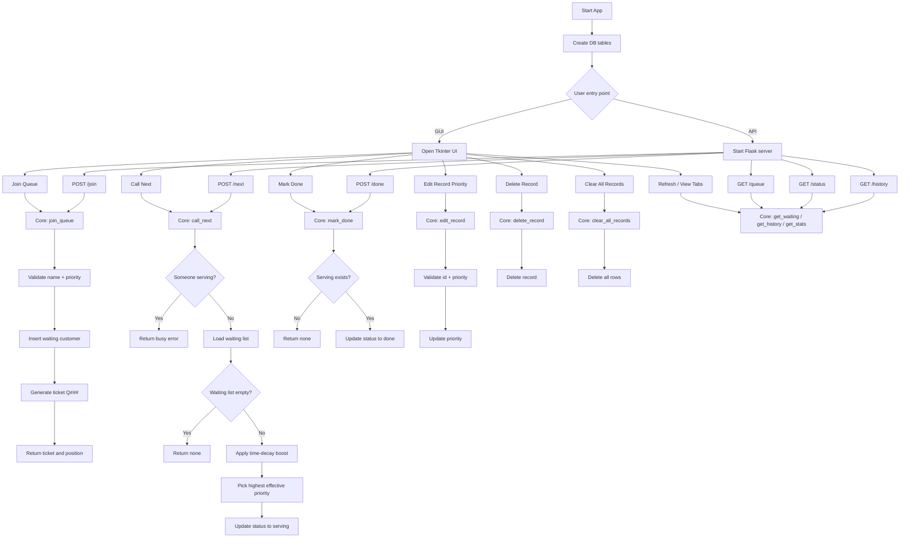

```mermaid
flowchart TD
    A[Start App] --> B[Create DB tables]
    B --> C{User entry point}

    C -->|GUI| D[Open Tkinter UI]
    C -->|API| E[Start Flask server]

    D --> D1[Join Queue]
    D --> D2[Call Next]
    D --> D3[Mark Done]
    D --> D4[Edit Record Priority]
    D --> D5[Delete Record]
    D --> D6[Clear All Records]
    D --> D7[Refresh / View Tabs]

    E --> E1[POST /join]
    E --> E2[GET /queue]
    E --> E3[GET /status]
    E --> E4[POST /next]
    E --> E5[POST /done]
    E --> E6[GET /history]

    D1 --> F[Core: join_queue]
    E1 --> F
    F --> F1[Validate name + priority]
    F1 --> F2[Insert waiting customer]
    F2 --> F3[Generate ticket Q###]
    F3 --> F4[Return ticket and position]

    D2 --> G[Core: call_next]
    E4 --> G
    G --> G1{Someone serving?}
    G1 -->|Yes| G2[Return busy error]
    G1 -->|No| G3[Load waiting list]
    G3 --> G4{Waiting list empty?}
    G4 -->|Yes| G5[Return none]
    G4 -->|No| G6[Apply time-decay boost]
    G6 --> G7[Pick highest effective priority]
    G7 --> G8[Update status to serving]

    D3 --> H[Core: mark_done]
    E5 --> H
    H --> H1{Serving exists?}
    H1 -->|No| H2[Return none]
    H1 -->|Yes| H3[Update status to done]

    D4 --> I[Core: edit_record]
    I --> I1[Validate id + priority]
    I1 --> I2[Update priority]

    D5 --> J[Core: delete_record]
    J --> J1[Delete record]

    D6 --> K[Core: clear_all_records]
    K --> K1[Delete all rows]

    D7 --> L[Core: get_waiting / get_history / get_stats]
    E2 --> L
    E3 --> L
    E6 --> L
```